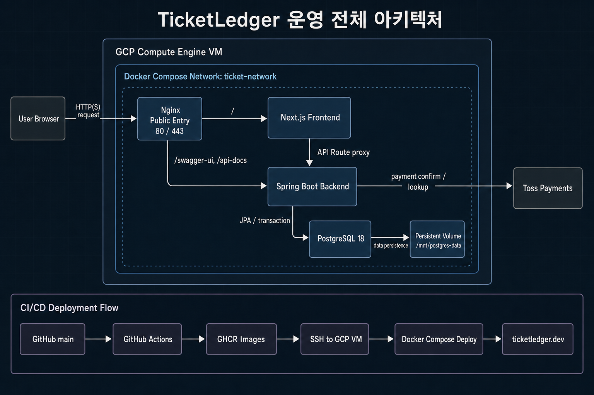
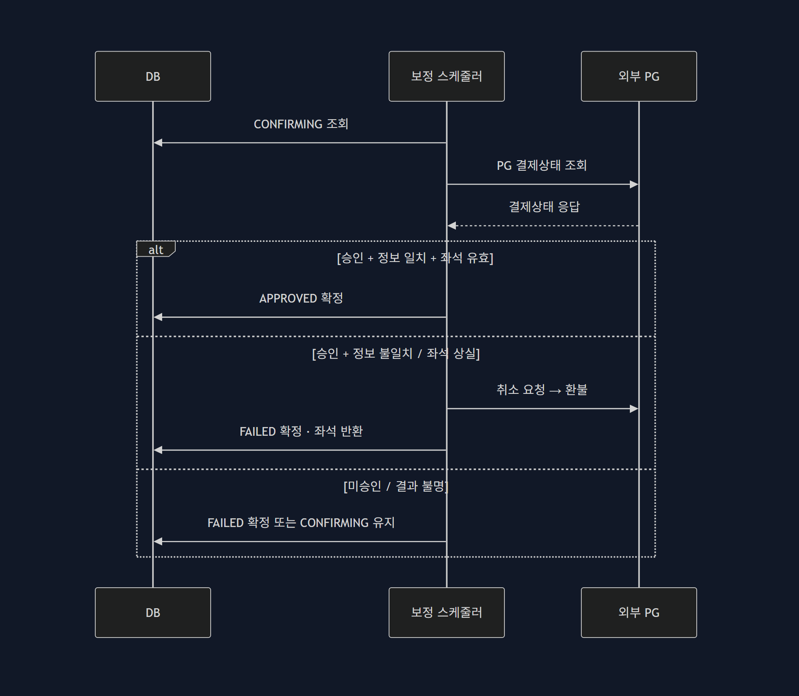

# TicketLedger 백엔드

TicketLedger 백엔드는 **인기 공연 오픈 시점의 예약·결제 정합성, 조회 성능, 사용자 예매 이력 조회 성능을 함께 다루는 티켓 예매 API 서버**입니다. 좌석 선점, 예약 만료, 결제 확정이 서로 어긋나지 않도록 상태 전이와 트랜잭션 경계를 중심으로 설계했습니다.

## 바로가기

- [배포 사이트](#배포-사이트)
- [운영 환경 로그인 정보](#운영-환경-로그인-정보)
- [30초 요약](#30초-요약)
- [해결한 문제 요약](#해결한-문제-요약)
- [시스템 아키텍처](#시스템-아키텍처)
- [성능 테스트 해석 기준](#성능-테스트-해석-기준)
- [핵심 문제](#핵심-문제)
- [핵심 도메인 흐름](#핵심-도메인-흐름)
- [운영 관측성](#운영-관측성)
- [주요 설계 판단](#주요-설계-판단)
- [정합성 검증 시나리오](#정합성-검증-시나리오)
- [인기 공연 성능 개선 결과](#인기-공연-성능-개선-결과)
- [마이페이지 N+1 개선 결과](#마이페이지-n1-개선-결과)
- [병목을 어떻게 좁혔는가](#병목을-어떻게-좁혔는가)
- [주요 API 흐름](#주요-api-흐름)
- [패키지 구조](#패키지-구조)
- [기술 스택](#기술-스택)
- [실행 방법](#실행-방법)
- [상세 문서 바로가기](#상세-문서-바로가기)

## 배포 사이트

- 서비스: [https://ticketledger.dev](https://ticketledger.dev)
- API 명세서: 운영 사이트에서 관리자 계정으로 로그인하면 헤더의 `API 문서` 버튼이 노출됩니다.
- Swagger UI: [https://ticketledger.dev/swagger-ui/index.html](https://ticketledger.dev/swagger-ui/index.html)
- Swagger에서 `401`이 표시되면 메인 페이지로 돌아가 새로고침한 뒤, 다시 `API 문서`로 이동해 Swagger 화면을 새로고침하면 됩니다.

## 운영 환경 로그인 정보

배포 사이트 확인용 운영 계정입니다.

| 구분 | 이메일 | 비밀번호 |
| --- | --- | --- |
| 관리자 | `admin@admin.com` | `a123456789` |
| 일반 사용자 | `user@user.com` | `a123456789` |

## 30초 요약

- 인기 공연 오픈 시점에 같은 좌석으로 요청이 몰리는 상황을 가정했습니다.
- 예매 단위는 개별 좌석이 아니라 `ReservationGroup`으로 묶었습니다.
- 좌석 선점은 정렬된 좌석 ID와 DB 행 잠금으로 처리했습니다.
- 결제 승인은 `READY -> CONFIRMING -> APPROVED`로, 결제 취소는 `APPROVED -> CANCELING -> CANCELED`로 나누고, PG 호출 전후 트랜잭션을 분리했습니다.
- 외부 PG 호출에는 connect/read timeout을 두고, 응답 불명 상태는 `CONFIRMING`/`CANCELING` 보정 흐름으로 수렴시킵니다.
- 결제되지 않은 선점 좌석은 만료 후 다시 `AVAILABLE`로 복구합니다.
- 재기동 후 backlog가 한 번에 몰리지 않도록 보정/만료 스케줄러는 한 주기 처리량을 제한합니다.
- 고부하 전체 여정 테스트에서는 완료 결제 `1,000`건, 중복 좌석 `0`, 부분 성공 `0`, 상태 불일치 `0`을 확인했습니다.
- 마이페이지는 예매 그룹 `100`개 조건에서 N+1과 반복 조회 비용을 줄였습니다.

## 해결한 문제 요약

| 영역 | 문제 | 해결 | 검증 |
| --- | --- | --- | --- |
| 예약/결제 정합성 | 같은 좌석에 예약 요청이 동시에 몰릴 수 있습니다. | 좌석 ID 정렬, DB 행 잠금, `ReservationGroup` 단위 상태 전이로 처리했습니다. | 완료 결제 `1,000`, 중복 좌석 `0`, 부분 성공 `0`, 상태 불일치 `0` |
| 인기 공연 조회 성능 | 매진 이후에도 좌석 `1,000`건 조회가 반복될 수 있습니다. | 공연 목록/상세 캐시, 좌석 조회 트랜잭션 범위 축소, SoldOut 정책을 적용했습니다. | 전체 여정 RPS `223.06 -> 336.94`, p95 `15.60s -> 244ms` |
| 마이페이지 N+1 | 예매 이력이 많아질수록 연관 데이터 조회와 DTO 조립 비용이 커집니다. | `reservation/payment` fetch join과 groupId 기준 `Map` 재사용으로 반복 조회를 제거했습니다. | group `100` 기준 p95 `202.75ms -> 17.52ms`, 처리량 `60.73 -> 663.46 req/s` |

## 시스템 아키텍처

### 운영 / 배포 구조

운영 서버는 단일 GCP Compute Engine VM에서 Docker Compose로 nginx, frontend, backend, PostgreSQL을 하나의 네트워크(`ticket-network`)로 묶어 운영합니다. 외부 진입점은 nginx `80/443`으로 제한하고, frontend, backend, PostgreSQL은 직접 노출하지 않습니다.



### 요청 흐름

사용자 요청은 nginx가 받아 대부분 frontend로 전달하고, frontend가 API Route proxy를 통해 Docker 내부 네트워크에서 backend를 호출합니다. 백엔드로 직접 전달되는 외부 경로는 `/swagger-ui`, `/api-docs` 문서 경로로 제한하며, 결제 승인과 조회는 backend가 외부 PG로 아웃바운드 호출합니다.

## 성능 테스트 해석 기준

- 성능 수치는 운영 최대 RPS나 SLO를 보장하는 값이 아니라, 같은 로컬 통제 조건에서의 개선 전후 비교값입니다.
- k6 부하 발생기, 애플리케이션 서버, PostgreSQL, Mock PG를 같은 로컬 장비에서 실행했습니다.
- 부하 발생기와 애플리케이션이 CPU·네트워크·디스크 자원을 공유하므로 절대 수치를 운영 처리량으로 해석하지 않습니다.
- `ramping-arrival-rate`는 응답 완료와 독립적으로 iteration을 시작하는 open-model 실행 방식입니다.
- 인기 공연 시나리오에서는 정상 경합 거부와 매진 거부가 장애가 아니므로, 예상 밖 오류와 분리해서 봤습니다.
- 결제 완료 RPS는 좌석 수 `1,000`개에 의해 상한이 생기므로 전체 여정 RPS와 분리해서 해석했습니다.
- 좌석 상태는 캐시하지 않았고, SoldOut 정책은 매진 확정 뒤 반복 좌석 조회를 줄이는 보조 최적화로만 사용했습니다.

## 핵심 문제

| 문제 | 필요한 처리 |
| --- | --- |
| 동일 좌석에 여러 사용자가 동시에 접근합니다. | 하나의 요청만 좌석 선점에 성공하고 나머지는 정상 경합으로 거부되어야 합니다. |
| 사용자는 여러 좌석을 한 번에 예매할 수 있습니다. | 선택한 좌석 전체가 가능할 때만 예매 그룹이 생성되어야 합니다. |
| 선점 후 결제하지 않는 사용자가 생깁니다. | 결제되지 않은 좌석은 만료 후 다시 예매 가능 상태로 돌아가야 합니다. |
| 결제 완료는 여러 상태를 함께 바꿉니다. | 결제, 예매 그룹, 개별 예매, 좌석 상태가 하나의 결과로 확정되어야 합니다. |
| 인기 공연 오픈 시점에는 조회와 경합 실패가 반복됩니다. | 정상 경합/매진 거부와 예상 밖 오류를 분리해서 처리해야 합니다. |
| 예매 이력이 많은 사용자의 마이페이지 조회가 느려집니다. | 필요한 예매/결제/좌석 정보를 유지하면서 반복 조회 비용을 줄여야 합니다. |

## 핵심 도메인 흐름

```text
공연/회차 선택
-> 좌석 조회
-> 좌석 선점
-> ReservationGroup 생성
-> Payment READY 생성
-> Payment CONFIRMING 저장
-> PG 승인 요청
-> Payment APPROVED
-> ReservationGroup / Reservation CONFIRMED
-> Seat BOOKED
```

### 결제 승인과 장애 보정 흐름

결제 승인은 `READY -> CONFIRMING` 커밋, 외부 PG 승인 요청, 내부 확정 커밋으로 나눕니다. 외부 PG 호출 동안 DB 락을 오래 잡지 않으면서, 승인 요청 후 응답 유실·타임아웃·서버 장애가 발생해도 `CONFIRMING` 상태를 복구 기준으로 남깁니다.

요청 처리가 살아있으면 컨트롤러가 동기 재조회를 한 번 더 시도합니다. 그래도 확정하지 못하거나 프로세스가 중단되면 보정 스케줄러가 오래된 `CONFIRMING` 결제를 조회하고, 외부 PG 결제 상태를 기준으로 내부 상태를 최종 수렴시킵니다.



| 외부 PG 조회 결과 | 내부 정보 | 좌석 상태 | 처리 |
| --- | --- | --- | --- |
| 승인 | `orderId`·금액·통화 일치 | 유효 | `Payment APPROVED`, 예매 `CONFIRMED`, 좌석 `BOOKED`로 확정 |
| 승인 | 정보 불일치 | - | 외부 PG 취소 요청 후 `FAILED`로 정리 |
| 승인 | 정보 일치 | 좌석 상실 | 외부 PG 취소 요청 후 `FAILED`, 좌석 반환으로 정리 |
| 미승인 | - | - | `FAILED`로 정리 |
| 결과 불명 | - | - | `CONFIRMING`을 유지하고 다음 보정 주기에 재시도 |

### 결제 취소와 장애 보정 흐름

결제 취소도 승인과 같은 3단계로 나눕니다. `APPROVED -> CANCELING` 커밋, 외부 PG 취소 요청, `CANCELING -> CANCELED` 커밋입니다. 취소 요청 후 응답 유실·타임아웃·서버 장애가 발생하면 `CANCELING`이 복구 기준으로 남습니다.

`CANCELING`은 되돌리지 않습니다. 결과가 불명확한 동안에는 좌석이 `BOOKED`, 예매 그룹이 `CONFIRMED`, 대금이 PG에 남아 있으므로 이중 판매도 대금 손실도 발생하지 않습니다. 보정 스케줄러가 오래된 `CANCELING` 결제를 PG 조회 결과 기준으로 `CANCELED`까지 수렴시킵니다.

| 외부 PG 조회 결과 | 처리 |
| --- | --- |
| 취소 완료 | `Payment CANCELED`, 예매 `CANCELED`, 좌석 `AVAILABLE`로 확정 |
| 아직 승인 상태 | PG 취소를 같은 idempotency key로 다시 요청 |
| 취소 불가 응답 | `CANCELING`을 유지하고 수동 확인 대상으로 남김 |
| 결과 불명 | `CANCELING`을 유지하고 다음 보정 주기에 재시도 |

취소 API는 `@AuthenticationPrincipal` 기준으로 결제 소유자를 검증하고, 타인 결제 취소 시도는 `403`으로 차단합니다.

### 상태 전이 요약

| 대상 | 주요 상태 전이 |
| --- | --- |
| Seat | `AVAILABLE -> HELD -> BOOKED`, `HELD -> AVAILABLE`, `BOOKED -> AVAILABLE` |
| ReservationGroup | `PENDING -> CONFIRMED`, `PENDING -> EXPIRED`, `CONFIRMED -> CANCELED` |
| Reservation | `PENDING -> CONFIRMED`, `PENDING -> EXPIRED`, `CONFIRMED -> CANCELED` |
| Payment | `READY -> CONFIRMING -> APPROVED`, `READY/CONFIRMING -> FAILED`, `APPROVED -> CANCELING -> CANCELED` |

`CONFIRMING`과 `CANCELING`은 PG 호출에 들어갔지만 내부 확정이 아직 끝나지 않은 회색지대입니다. 두 상태 모두 영속 마커로 남겨 동기 재조회와 비동기 보정 스케줄러의 기준점으로 사용합니다. `CONFIRMING`은 `APPROVED` 또는 `FAILED`로, `CANCELING`은 오직 `CANCELED`로만 수렴하며 `APPROVED`로 되돌리지 않습니다.

상세 상태 정책은 [docs/design/state-design.md](docs/design/state-design.md)에 정리했습니다.

## 운영 관측성

운영에서 장애가 났을 때 "누가 / 어떤 요청을 / 어떤 결과로" 추적할 수 있도록, 분산 추적 인프라(Sleuth/OTel) 없이 단일 서비스에 맞는 경량 3계층 로깅을 적용했습니다.

| 계층 | 구현 | 목적 |
| --- | --- | --- |
| 상관관계 ID | `TraceIdFilter`가 요청마다 traceId 발급 → MDC에 담아 모든 로그 줄에 자동 부착(`%X{traceId}`). 인증 통과 후 `JwtAuthenticationFilter`가 userId도 주입 | 한 요청의 전 처리 흐름(인증→컨트롤러→서비스→PG 호출)을 traceId로 묶음 |
| 접근 로그 | `AccessLogFilter`가 요청 1건당 요약 한 줄(method/path/status/durationMs/ip), 5xx는 warn | 요청 단위 유입/응답 추적 |
| 에러 추적 | `ErrorResponse`에 traceId 노출, `GlobalExceptionHandler`에서 4xx=warn(스택 생략)/5xx=error(스택 포함) 일원화 | 사용자에게 내려간 에러를 서버 로그와 연결 |

설계 판단:

- traceId 필터는 `Ordered.HIGHEST_PRECEDENCE`로 등록해 Spring Security 필터(`DelegatingFilterProxy`, order `-100`)보다 먼저 실행 → 인증 실패 로그까지 traceId로 묶입니다.
- 스레드 풀 재사용에 따른 MDC 값 누수를 막기 위해 요청 종료 시 `finally`에서 `MDC.clear()` 합니다.
- 접근 로그에는 request body/query string을 남기지 않습니다(비밀번호·토큰·결제정보 유출 방지).
- `DataAccessException`은 SQL/스키마가 새지 않도록 클라이언트에 고정 메시지만 반환하고, 상세·스택은 서버 로그에만 남깁니다.
- 실제 클라이언트 IP는 다단 프록시(nginx→FE→BE)에서 유실되므로, nginx의 `X-Real-IP`/`X-Forwarded-For`를 FE(BFF/SSR)가 전달하고 backend가 이를 읽습니다.
- 주기 스케줄러는 처리량이 있을 때만 info, 0건이면 debug로 남겨 로그 노이즈를 줄였습니다.

설계 근거와 트레이드오프 상세는 비공개 설계 문서(`docs/private/design/logging-design-decision.md`, `logging-filters-explained.md`)에 정리했습니다.

### Prometheus 메트릭 기준선

`Actuator + Micrometer Prometheus Registry`로 `/actuator/prometheus`를 열고 다음 기본 지표를 수집할 수 있게 구성했습니다.

| 대상 | 주요 지표 |
| --- | --- |
| API | 요청 수, 상태 코드, 응답 시간 histogram(p95 계산용) |
| JVM | heap, GC, thread, CPU |
| Tomcat | thread pool 사용량 |
| DB pool | Hikari active, idle, pending, max connection |
| 결제 도메인 | 회색지대 backlog, 보정 결과 분포, PG 호출 실패(아래 회색지대 지표) |

메트릭 endpoint는 인증 없이 Prometheus가 scrape할 수 있습니다. 운영에서는 backend host port를 publish하지 않고 `expose`만 사용하며, nginx가 `/actuator` 경로를 차단하므로 외부에서는 접근할 수 없습니다. scrape는 내부 network에서만 수행합니다.

### 외부 호출 / backlog 보호 설정

운영 프로필은 외부 PG 지연과 재기동 직후 backlog를 같이 고려해 보수적인 시작값을 사용합니다.

| 항목 | 운영값 | 의도 |
| --- | ---: | --- |
| 외부 PG connect timeout | `2s` | 연결 자체가 지연되는 외부 장애에서 요청 thread가 오래 묶이지 않게 합니다. |
| 외부 PG read timeout | `5s` | 결제 결과 응답 대기가 길어질 때 결과 불명으로 보고 `CONFIRMING`/`CANCELING` 보정 흐름에 넘깁니다. |
| 결제 보정 batch-size | `20` | PG 조회/취소 외부 호출이 포함되므로 한 주기 처리량을 작게 시작합니다. |
| 예약 만료 batch-size | `100` | DB 상태 전이가 중심인 전역 스케줄러 backlog를 제한합니다. |

이 값들은 최대 처리량 목표가 아니라, 서버 재기동 직후 backlog 처리 때문에 다시 장애가 나는 상황을 막기 위한 안전한 시작점입니다. 실제 조정은 `CONFIRMING`/`CANCELING` 잔존 수, 보정 실패 수, 만료 후보 수, DB/PG 부하 지표를 보고 진행합니다.

회색지대 지표는 Micrometer로 노출합니다.

| 지표 | 태그 | 의미 |
| --- | --- | --- |
| `payment_gray_zone_recovery_total` | `operation`, `outcome` | 보정 시도의 결과 분포(승인 확정, 실패 정리, 환불 후 실패, 수동 보류 등) |
| `payment_gray_zone_pg_failure_total` | `operation`, `call` | PG 조회/승인/취소 호출이 결과 불명으로 끝난 횟수 |
| `payment_gray_zone_backlog` | `status` | 스케줄러 한 주기 기준 `CONFIRMING`/`CANCELING` 잔존 건수 |

## 주요 설계 판단

README에는 선택과 대안의 핵심만 요약하고, 상세 트레이드오프와 실험 근거는 docs 문서에 분리했습니다.

| 판단 | 선택하지 않은 대안 | 선택 이유 | 검증 근거 |
| --- | --- | --- | --- |
| `ReservationGroup` 기준으로 예매를 묶었습니다. | 좌석마다 독립 예매를 생성하는 방식 | 다중 좌석 예매와 결제 1건의 관계를 명확히 관리하기 위해서입니다. | 부분 성공 예매 그룹 `0`을 확인했습니다. |
| 좌석 ID를 정렬한 뒤 DB 행 잠금을 사용했습니다. | Redis 분산락을 먼저 도입하는 방식 | 현재 단일 DB 구조에서는 잠금 책임을 DB 트랜잭션 안에 두는 편이 단순하고 검증하기 쉽기 때문입니다. | 동일/겹치는 좌석 요청에서 하나의 예매 그룹만 성공했습니다. |
| 결제 승인에 `CONFIRMING` durable 마커를 적용했습니다. | PG 호출 동안 DB 락을 계속 잡는 방식 | 외부 호출 시간을 트랜잭션 밖으로 빼면서, 크래시 이후에도 보정 대상을 남기기 위해서입니다. | `CONFIRMING` 보정, 만료 경합, PG 재조회 테스트를 통과했습니다. |
| 결제 취소에도 `CANCELING` durable 마커를 두어 승인과 대칭 구조로 맞췄습니다. | 취소는 예외를 던지고 `APPROVED`로 두는 방식 | 취소 역시 외부 PG와 내부 DB가 나뉘므로, 응답 불명 상태를 보정 대상으로 남겨야 하기 때문입니다. | 취소 timeout·재취소·소유자 검증 테스트를 통과했습니다. |
| `CANCELING`은 `CANCELED`로만 수렴시키고 되돌리지 않습니다. | 취소 실패 시 `APPROVED`로 복귀시키는 방식 | 되돌리면 PG에서 이미 취소된 결제를 내부적으로 승인 상태로 유지해 대금·좌석 불일치가 남기 때문입니다. | 회색지대 상태에서 좌석 `BOOKED`, 예매 `CONFIRMED` 유지로 이중 판매가 발생하지 않음을 확인했습니다. |
| 가용 상태 기반 SoldOut 정책을 적용했습니다. | 매진 이후에도 좌석 목록 projection 조회를 반복하는 방식 | 만료 좌석의 즉시 재판매 정책은 유지하되, `AVAILABLE=0`, `HELD=0`, `BOOKED>0`이면 좌석 목록 조회를 생략하기 위해서입니다. | 전체 여정 p95 `2.66s -> 244ms`, 좌석 조회 p95 `1.31s -> 11.58ms`, dropped iteration `1,108 -> 0`을 확인했습니다. |
| PG 승인/취소 후 상태를 재확인합니다. | PG 응답이나 redirect 결과만 신뢰하는 방식 | 외부 API 응답을 받지 못한 경우에도 내부 상태를 한 방향으로 수렴시키기 위해서입니다. | `paymentKey` 조회 결과를 기준으로 승인/취소 상태를 확정했습니다. |
| 정상 경합 거부와 예상 밖 오류를 분리했습니다. | HTTP 실패율만 보는 방식 | 인기 공연에서는 매진/경합 거부가 장애가 아니라 정상 결과일 수 있기 때문입니다. | k6 지표에서 예상된 거부와 예상 밖 오류를 나눴고 예상 밖 오류 `0`을 확인했습니다. |
| 결제 금액 계산을 `PaymentAmount` 값객체로 단일화했습니다. | 도메인과 컨트롤러에 VAT 계산을 각각 정의하는 방식 | 세율·반올림 규칙을 한 곳에 모아 중복과 매직넘버를 없애고, 부동소수 대신 정수 연산으로 정밀도를 확보하기 위해서입니다. | 좌석금액·VAT·총액 계산과 음수/오버플로 검증 테스트를 통과했습니다. |

## 정합성 검증 시나리오

| 시나리오 | 구현 방식 | 검증 결과 |
| --- | --- | --- |
| 동일 좌석 동시 선점 | 좌석 ID 정렬 + DB 행 잠금 | 하나의 예매 그룹만 성공했습니다. |
| 겹치는 좌석 묶음 요청 | 같은 좌석 집합에 동일한 잠금 순서 적용 | 중복 활성 좌석이 생기지 않았습니다. |
| 다중 좌석 예매 | `ReservationGroup` 기준으로 전체 좌석을 한 번에 검증 | 부분 성공 예매 그룹 `0`을 확인했습니다. |
| 예약 만료 | 만료된 예매 그룹, 예매, 좌석, 결제를 같은 흐름으로 정리 | 좌석이 다시 `AVAILABLE`로 복구되었습니다. |
| 중복 결제 준비 | 같은 예매 그룹에 대해 기존 `READY` 결제를 재사용 | 결제 row가 중복 생성되지 않았습니다. |
| 중복 결제 승인 | 동일 `orderId` 동시 승인 요청을 같은 멱등키로 처리 | 승인 결제 row `1`건으로 수렴했습니다. |
| 결제 승인 | `CONFIRMING` 마커 이후 PG 결과를 검증하고 예매/좌석 상태 확정 | 상태 불일치 `0`을 확인했습니다. |
| 결제 취소 | 승인된 결제, 예매 그룹, 예매, 좌석 상태를 같은 흐름으로 복구 | 좌석이 다시 `AVAILABLE`로 복구되었습니다. |
| 결제 승인과 만료 경합 | `CONFIRMING` 결제는 만료 대상에서 제외하고 상태 재확인 | 승인 중인 결제를 만료로 덮어쓰지 않았습니다. |
| PG 승인 후 내부 반영 중단 | 오래된 `CONFIRMING` 결제를 PG 조회로 보정 | `DONE + HELD`는 승인 확정, 좌석 소실·금액 불일치는 환불 후 실패로 정리했습니다. |
| 리프레시 토큰 재발급 | 리프레시 토큰 조건부 갱신 | 같은 토큰 동시 재발급 요청 중 하나만 성공했습니다. |

## 인기 공연 성능 개선 결과

인기 공연 오픈 직후 시나리오는 공연 목록, 상세, 좌석 조회, 예약 생성, 결제 준비, 모의 PG 승인, 결제 확정까지 이어지는 전체 여정으로 측정했습니다.

### 측정 시나리오 (인기 공연 오픈 스파이크)

아래 수치는 다음 부하 조건에서 나온 값입니다. (`performance/k6/popular-event-payment-arrival-rate-spike.js`)

| 항목 | 값 |
| --- | --- |
| 부하 모델 | `ramping-arrival-rate` (open model — 응답과 무관하게 초당 요청을 투입) |
| 도착률 구간 | `10 → 100 → 300 → 500 → 1,000 iter/s → 100` |
| 구간 시간 | `5s + 10s·4 + 5s` = 총 `50s` |
| 스파이크 정점 | 초당 `1,000` iteration 투입 (`preAllocatedVUs 1,500` / `maxVUs 3,000`) |
| 1 iteration | 목록 → 상세 → 좌석 조회 → 예약 → 결제 준비 → 결제 확정 전체 여정 |
| 좌석 풀 | 단일 회차 `1,000`석 |
| 합격 기준 | 예상 밖 오류율 `< 1%`, 결제 완료율 `> 99%` |

> 부하 단위는 동접 VU가 아니라 **초당 iteration 투입량(arrival rate)** 입니다. open model이라 서버가 느려져도 투입량이 줄지 않아 인기 공연 오픈 순간을 더 가혹하게 재현하며, VU(최대 `3,000`)는 이 도착률을 만들기 위한 워커일 뿐입니다.

이 수치의 해석 기준은 위 [성능 테스트 해석 기준](#성능-테스트-해석-기준)을 따릅니다. README에서는 p95와 RPS보다 **정합성이 깨지지 않았는지**를 더 중요한 기준으로 봅니다.

| 단계 | 핵심 변경 | 전체 여정 RPS | 전체 여정 p95 | 시작 실패 iteration | 완료 결제 | 예상 밖 오류 |
| --- | --- | ---: | ---: | ---: | ---: | ---: |
| 초기 관찰 | 캐시/SoldOut 정책 전 | `223.06 RPS` | `15.60s` | `5,694` | `1,000` | `0` |
| 공연 캐시 | 목록/상세 로컬 캐시(당시 Caffeine) | `311.46 RPS` | `2.93s` | `1,274` | `1,000` | `0` |
| 트랜잭션 분리 | 만료 처리 쓰기 트랜잭션과 좌석 조회 분리 | `314.78 RPS` | `2.66s` | `1,108` | `1,000` | `0` |
| SoldOut 정책 | 가용 상태 기반 좌석 목록 조회 생략 | `336.94 RPS` | `244ms` | `0` | `1,000` | `0` |

DB 사후 검증 결과:

| 항목 | 결과 |
| --- | ---: |
| `BOOKED` 좌석 | `1,000` |
| 예매 그룹 | `1,000` |
| 결제 | `1,000` |
| 중복 활성 좌석 배정 | `0` |
| 부분 성공 예매 그룹 | `0` |
| `APPROVED / CONFIRMED / BOOKED` 상태 불일치 | `0` |

상세 실험 과정과 해석은 [docs/performance/performance-e2e-optimization-summary.md](docs/performance/performance-e2e-optimization-summary.md), 전체 성능 테스트 전략은 [docs/performance/performance-test-strategy.md](docs/performance/performance-test-strategy.md)에 정리했습니다.

## 마이페이지 N+1 개선 결과

마이페이지 조회는 예매 그룹, 개별 좌석, 결제 정보를 함께 보여줘야 하므로 응답 구조를 단순히 줄이는 방식으로 해결하지 않았습니다. 대신 한 번 조회한 예매 목록을 groupId 기준으로 묶어 재사용하고, DTO 변환 중 필요한 연관 데이터는 fetch join으로 함께 가져오도록 정리했습니다.

| 조건 | 개선 전 p95 | 개선 후 p95 | 개선 전 처리량 | 개선 후 처리량 |
| --- | ---: | ---: | ---: | ---: |
| group `100`, `10 VU / 30s` | `202.75ms` | `17.52ms` | `60.73 req/s` | `663.46 req/s` |

선택 이유:

- `Reservation` 조회에는 `ReservationGroup`, `Seat`, `Schedule`, `Event`가 필요하므로 fetch join으로 DTO 변환 중 발생하는 지연 로딩을 줄였습니다.
- `Payment` 조회에는 `ReservationGroup`이 필요하므로 payment 목록도 fetch join으로 가져왔습니다.
- 결제 DTO에도 같은 좌석 목록이 필요하지만 groupId가 같다면 이미 조회한 reservation 목록을 재사용할 수 있어, `findByReservationGroupId(...)`를 반복 호출하지 않도록 `Map<Long, List<Reservation>>`으로 묶었습니다.
- 인덱스 후보 `reservations(reservation_group_id)`는 `EXPLAIN ANALYZE`에서 실제 사용 이득이 확인되지 않아 Flyway migration에는 반영하지 않았습니다.

## 병목을 어떻게 좁혔는가

성능 개선은 특정 원인을 미리 단정하지 않고, 같은 인기 공연 전체 여정 조건에서 가설을 하나씩 확인하는 방식으로 진행했습니다.

| 가설 | 실험 | 결과 | 판단 |
| --- | --- | --- | --- |
| 예약 만료 처리 트랜잭션이 병목입니다. | 만료 처리 제거/트랜잭션 범위 분리 후 재측정 | 일부 개선은 있었지만 전체 병목을 단독으로 설명하지 못했습니다. | 단독 원인으로 보지 않았습니다. |
| DB 커넥션 풀이 부족합니다. | Hikari pool 크기 조정 후 재측정 | p95와 완료 처리량 차이가 크지 않았습니다. | 단독 원인으로 보지 않았습니다. |
| 매진 이후에도 좌석 목록 조회가 반복됩니다. | 회차별 가용 상태를 먼저 집계하고, `soldOut=true`이면 좌석 목록 조회 없이 빈 `seats`를 반환했습니다. | 완료 결제 `1,000`, 중복 좌석 `0`, 부분 성공 `0`, 상태 불일치 `0`을 유지했습니다. 응답 크기 감소는 부가 효과로 봤습니다. | SoldOut 정책으로 채택했습니다. |

이 과정에서 핵심으로 본 것은 p95 자체보다, 조회 최적화 이후에도 예약·결제 상태 정합성이 깨지지 않는지였습니다.

<a id="주요-api-흐름"></a>
<details>
<summary>주요 API 흐름</summary>

### 인증

```text
POST /api/v1/auth/login
-> 이메일/비밀번호 검증
-> 액세스 토큰 + 리프레시 토큰 발급
-> HttpOnly 쿠키 반환
```

```text
POST /api/v1/auth/reissue
-> 리프레시 토큰 조건부 갱신
-> 한 번만 소비되도록 재발급
```

```text
GET /api/v1/users/me
-> 현재 로그인 사용자 정보 반환
```

인증 흐름과 쿠키 기반 토큰 정책은 [docs/design/auth-flow-readme.md](docs/design/auth-flow-readme.md)에 정리했습니다.

### 공연/좌석

```text
GET /api/v1/event
GET /api/v1/event/{eventId}
GET /api/v1/event/schedules/availability?scheduleIds=...
GET /api/v1/event/schedules/{scheduleId}/seats
```

`/event`, `/event/{eventId}`는 이미 시작한 회차를 제외하고 예매 가능한 미래 회차만 응답합니다. 미래 회차가 없는 공연은 목록 응답에서 제외됩니다.

`/seats`는 회차별 만료 처리를 먼저 수행합니다. 이후 가용 상태 기준으로 매진이면 `{ scheduleId, soldOut: true, seats: [] }`를 반환합니다.

### 예약/결제

```text
POST /api/v1/reservations
POST /api/v1/payments/ready
POST /api/v1/payments/confirm
POST /api/v1/payments/{paymentId}/cancel
GET  /api/v1/payments/{paymentId}/status
```

결제 승인은 `READY -> CONFIRMING` 커밋, PG 호출, `APPROVED / CONFIRMED / BOOKED` 커밋으로 나뉩니다. 결제 취소도 `APPROVED -> CANCELING` 커밋, PG 호출, `CANCELED / CANCELED / AVAILABLE` 커밋으로 대칭 분리됩니다. 취소 요청은 결제 소유자만 수행할 수 있습니다.

보정 스케줄러는 오래된 `CONFIRMING`/`CANCELING` 결제를 한 주기에 함께 조회하고, PG 상태를 기준으로 각각 승인 확정·실패/환불, 취소 확정으로 정리합니다.

</details>

## 패키지 구조

도메인별 패키지를 먼저 나누고, 각 도메인 내부를 `presentation`, `application`, `domain`, `infrastructure` 책임으로 분리했습니다.

```text
├── reservation          # 예매 / 좌석 선점 / 만료
│   ├── presentation     # ReservationController
│   │   └── dto          # CreateReservationRequest, ReservationResponse
│   ├── application      # ReservationService, ReservationExpirationService, Scheduler
│   └── domain           # Reservation, ReservationGroup, Status, Repository
├── payment              # 결제 준비 / 승인 / 취소 / 보정
│   ├── presentation     # PaymentApiController, HTTP 요청/응답 DTO
│   │   └── dto          # ReadyPayment*, ConfirmPayment*
│   ├── application      # PaymentService
│   │   ├── confirm      # PaymentConfirmService, TransactionService, PG 승인 검증
│   │   ├── cancel       # PaymentCancelService, TransactionService, 취소 정책
│   │   ├── recovery     # RecoveryScheduler, RecoveryService, RecoveryTransactionService
│   │   ├── observability# 회색지대 보정 메트릭
│   │   └── port/out     # PaymentGateway 계약과 PG 중립 응답 상태
│   ├── domain           # Payment, PaymentAmount, PaymentStatus, PaymentRepository
│   └── infrastructure   # TossPaymentClient, Toss 요청/응답 모델
├── auth                 # 로그인 / 토큰 / 쿠키 인증
│   ├── presentation     # AuthController
│   │   └── dto          # 로그인 요청/응답 DTO
│   ├── application      # AuthService, AuthTokens
│   │   └── port/out     # TokenProvider, TokenHashEncoder
│   ├── domain           # RefreshToken, RefreshTokenRepository
│   └── infrastructure   # JwtTokenProvider, JwtAuthenticationFilter, CookieProvider, TokenHasher
├── event                # 공연 / 회차 / 좌석 조회
│   ├── presentation     # EventController
│   ├── application      # EventQueryService
│   │   └── model        # EventListResponse, EventDetailResponse, ScheduleResponse
│   └── domain           # Event, Schedule, Repository
├── seat                 # 좌석 상태
│   ├── application      # SeatQueryService
│   │   └── model        # SeatResponse, SeatListResponse, SeatAvailabilityResponse
│   └── domain           # Seat, SeatStatus, SeatRepository
├── user                 # 사용자 / 마이페이지
│   ├── presentation     # UserController, 회원가입 요청 DTO
│   ├── application      # UserService
│   │   └── model        # 사용자/마이페이지 조회 결과
│   └── domain           # User, UserRole, UserStatus, UserRepository
└── global               # 전 계층 공통 관심사
    ├── config           # Cache, Security, Swagger, Time, 초기 데이터
    ├── security         # CSRF Origin 필터/설정
    ├── exception        # 공통 예외 응답
    └── log              # TraceId, AccessLog, LogEvents, 민감값 마스킹
```

계층별 책임은 다음과 같이 구분했습니다.

| 계층 | 책임 |
| --- | --- |
| `presentation` | HTTP 요청 검증, Controller, 웹 요청/응답 변환 |
| `application` | 유스케이스, 트랜잭션 경계, 출력 모델, 외부 시스템 포트 |
| `domain` | 엔티티, 상태, Repository 계약 |
| `infrastructure` | JWT, Cookie, 외부 PG 같은 외부 연동 |
| `global` | 보안, 설정, 예외, 로그 등 공통 관심사 |

애플리케이션 계층이 `infrastructure`와 `presentation`을 직접 참조하지 않도록 출력 포트로 의존성을 역전했습니다. 이 규칙은 ArchUnit 테스트로 검증합니다. 상세 기준은 [코드 아키텍처](docs/architecture/code-architecture.md)에 정리했습니다.

## 기술 스택

| 영역 | 사용 기술 | 사용 이유 |
| --- | --- | --- |
| 언어 | Java 21 | Spring Boot 기반 백엔드 구현에 사용했습니다. |
| 프레임워크 | Spring Boot 3.5.13, Spring Web | REST API와 계층형 애플리케이션 구성을 위해 사용했습니다. |
| 영속성 | Spring Data JPA, PostgreSQL, Flyway | 상태 전이, 행 잠금, 스키마 관리를 위해 사용했습니다. |
| 보안 | Spring Security, JWT, HttpOnly 쿠키 | 쿠키 기반 인증과 권한 검증을 위해 사용했습니다. |
| 캐시 | Spring Cache, Redis | 공연 목록/상세는 Redis Cache-Aside로 처리하고, 좌석 상태는 정합성 때문에 캐시하지 않습니다. |
| API 문서 | springdoc-openapi, Swagger UI | 운영 환경에서 API 확인이 가능하도록 사용했습니다. |
| 테스트 | JUnit 5, Spring Boot Test, Spring Security Test, Mockito | 상태 전이와 동시성 흐름 검증에 사용했습니다. |
| 성능 | k6, 모의 PG | 인기 공연 전체 여정 흐름을 외부 PG 부하 없이 검증하기 위해 사용했습니다. |

<a id="실행-방법"></a>
<details>
<summary>실행 방법</summary>

### 로컬 테스트

```powershell
.\gradlew.bat test
```

특정 테스트만 실행할 때:

```powershell
.\gradlew.bat test --tests "com.jipi.ticket_ledger.event.application.EventQueryServiceTest"
```

### 성능 테스트 전제

- 성능 테스트는 `dev,perf` 프로필을 기준으로 실행합니다.
- 모의 PG는 `127.0.0.1:18080`에서 실행합니다.
- 성능 테스트 사용자 풀은 `performance/data/perf-users.json`에 준비합니다.

```powershell
node performance/mock-pg/mock-pg-server.js
.\performance\reset-load-test-seats.ps1
$env:LOAD_PROFILE="arrival"
k6 run performance/k6/popular-event-payment-arrival-rate-spike.js
```

### 주요 확인값

- `arrival_e2e_journey_duration`
- `arrival_e2e_seat_lookup_duration`
- `arrival_e2e_payment_completed`
- `arrival_e2e_unexpected_rate`
- `dropped_iterations`
- DB 사후 정합성: 중복 활성 좌석, 부분 성공 예매 그룹, 상태 불일치

</details>

## 상세 문서 바로가기

| 문서 | 내용 |
| --- | --- |
| [docs/architecture/system-architecture.md](docs/architecture/system-architecture.md) | 운영 배포 구조와 요청 흐름 |
| [docs/design/state-design.md](docs/design/state-design.md) | 좌석, 예매, 결제 상태 전이 정책 |
| [docs/design/time-policy.md](docs/design/time-policy.md) | UTC 저장과 로컬 공연 시간 구분 정책 |
| [docs/design/auth-flow-readme.md](docs/design/auth-flow-readme.md) | 로그인, 재발급, HttpOnly 쿠키 인증 흐름 |
| [docs/design/external-api-client-tradeoffs.md](docs/design/external-api-client-tradeoffs.md) | PG 연동 HTTP 클라이언트 선택 기준 |
| [docs/design/payment-failure-recovery-design.md](docs/design/payment-failure-recovery-design.md) | CONFIRMING/CANCELING 회색지대 기반 결제 보정 설계와 남은 리팩토링 후보 |
| [docs/design/redis-cache-strategy.md](docs/design/redis-cache-strategy.md) | 공연 목록/상세 Redis Cache-Aside 적용 전략 |
| [docs/testing/concurrentTest.md](docs/testing/concurrentTest.md) | 겹치는 좌석 요청의 동시성 검증 |
| [docs/testing/TestCase.md](docs/testing/TestCase.md) | 상태 전이와 API 테스트 체크리스트 |
| [docs/performance/performance-e2e-optimization-summary.md](docs/performance/performance-e2e-optimization-summary.md) | 인기 공연 전체 여정 성능 개선 과정과 최종 지표 |
| [docs/performance/performance-test-strategy.md](docs/performance/performance-test-strategy.md) | k6 성능 테스트 시나리오와 측정 기준 |
| [docs/planning/backend-feature-roadmap.md](docs/planning/backend-feature-roadmap.md) | 후속 확장 후보와 설계 기준 |
