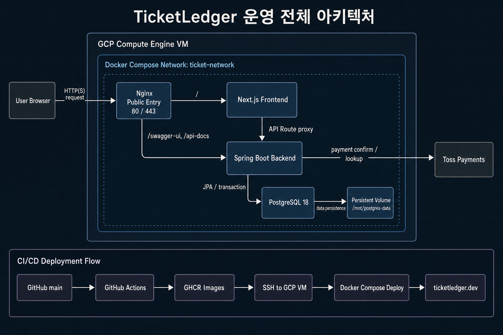

# 운영 전체 아키텍처

## 문서 목적

이 문서는 TicketLedger 운영 환경에서 브라우저 요청, Nginx, frontend, backend, PostgreSQL, Redis, Kafka, 관측 스택, 외부 결제 연동과 CI/CD 배포 흐름이 어떻게 연결되는지 정리합니다.

기준은 단일 GCP Compute Engine VM에서 Docker Compose로 운영하는 구조입니다.

## 전체 아키텍처



위 이미지는 외부 요청과 배포의 핵심 경로를 표시합니다. 현재 런타임에는 같은 Compose 네트워크의 Redis, Kafka, Prometheus, Redis Exporter와 Grafana가 추가되어 있습니다.

## 운영 / 배포 구조

- 운영 서버는 단일 GCP Compute Engine VM입니다.
- Docker Compose가 애플리케이션 스택과 관측 스택을 함께 관리합니다. Nginx, Next.js frontend, Spring Boot backend, PostgreSQL, Redis, Kafka는 `ticket-network`를 사용하고, Prometheus는 `ticket-network`와 `monitoring-network`에 함께 연결됩니다. Redis Exporter와 Grafana는 `monitoring-network`를 사용합니다.
- 외부 진입점은 Nginx `80/443`으로 제한합니다.
- frontend, backend, PostgreSQL, Redis, Kafka, Prometheus, Redis Exporter는 외부에 직접 노출하지 않고 Compose 내부 네트워크에서 통신합니다.
- Grafana는 VM loopback에만 연결하고 운영자가 SSH 터널로 접근합니다.
- PostgreSQL 데이터는 VM host volume인 `/mnt/postgres-data`에 유지해 컨테이너 재생성 후에도 보존합니다.
- Redis는 `redis-data` named volume에 AOF를 저장하고 `noeviction` 정책으로 대기열 상태의 임의 삭제를 막습니다.
- Kafka는 `kafka-data` named volume에 log를 저장하며 단일 KRaft broker로 Outbox 이벤트를 전달합니다.
- 결제 승인·조회·취소는 backend가 외부 PG로 아웃바운드 호출합니다.
- 결제 최종 상태와 함께 저장한 Outbox 이벤트는 Kafka main topic으로 발행하고, backend 내부 Audit Consumer가 Inbox와 감사 이력으로 저장합니다. 유효하지 않은 record는 audit DLT로 격리합니다.

## 요청 흐름

```text
User Browser
-> Nginx
-> Next.js frontend
-> Spring Boot backend
|-> PostgreSQL
|-> Redis cache / queue / seat lock
|-> Kafka payment events
|   `-> Audit Consumer -> PostgreSQL Inbox / audit
`-> External PG

Grafana
-> Prometheus
|-> Spring Boot /actuator/prometheus
`-> Redis Exporter -> Redis
```

일반 사용자 요청은 Nginx가 frontend로 전달합니다. frontend는 API Route proxy를 통해 Docker 내부 네트워크에서 backend를 호출합니다.

백엔드로 직접 전달되는 외부 경로는 운영 확인용 문서 경로인 `/swagger-ui`, `/api-docs`로 제한합니다.

## CI/CD 배포 흐름

```text
GitHub Actions 수동 실행
-> GHCR image
-> SSH to GCP VM
-> Docker Compose config validation
-> Docker Compose deploy
-> ticketledger.dev
```

GitHub Actions는 현재 자동 실행을 중단한 상태입니다. 필요할 때 `workflow_dispatch`로 수동 실행하면 운영 VM에 SSH 접속해 infra repository를 갱신하고 Docker Compose 설정을 검증한 뒤 컨테이너를 재배포합니다. `main` 브랜치 반영만으로는 실행되지 않습니다.

## 운영 기준

- 일반 API는 브라우저가 backend를 직접 호출하지 않고 frontend API Route를 거칩니다.
- Swagger UI와 API Docs는 포트폴리오 확인 목적의 제한된 외부 경로로 둡니다.
- DB, Redis와 Kafka는 외부 네트워크에 직접 열지 않고 운영 VM 내부 접근을 기준으로 관리합니다.
- Prometheus와 Redis Exporter는 내부 수집 경로만 사용하고, Grafana는 SSH 터널로만 접근합니다.
- 애플리케이션 이미지는 GHCR 기준으로 관리합니다.
